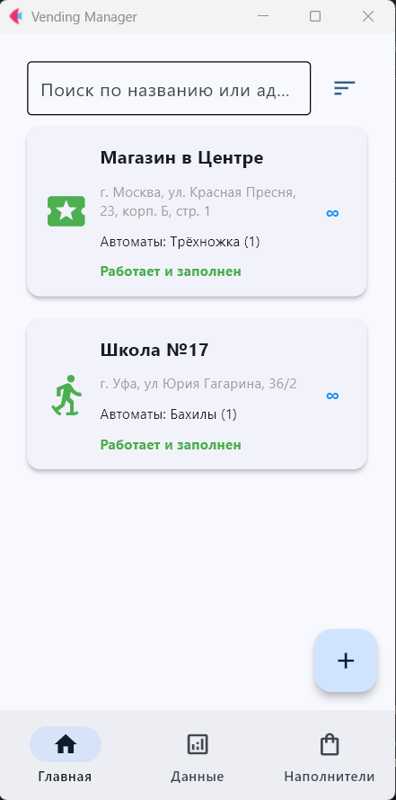

# VendingManager - учёт для вендингового бизнеса



Небольшое приложение на основе фреймворка Flutter, адаптированного под Python, для простого управления вендинговым бизнесом

## 🚀 Стек и возможности

- **Python Flet** - Библиотека для работы с современным фреймворком Flutter на Python
- **Страница с точками** - Здесь можно управлять действующими точками с автоматами
- **Поиск и сортировка** - Ищите точки по названию и адресу и сортируйте по разным критериям
- **Информация о точке** - Можно просматривать информацию о точке (кликабельный адрес, номера телефонов, типы автоматов и др.) и добавлять комментарии во время объезда
- **Учёт времени** - Добавляя комментарий к точке, вы автоматически создаёте временную точку, равную времени создания комментария, которая указывает на время последнего пребывания в точке
- **Меняйте данные** - Вы можете изменить любую информацию о точке, включая автоматы
- **Простая аналитика** - Страница с аналитикой включает в себя круговую диаграмму с данными о статусе всех точек и список всех типов и подтипов автоматов
- **Учёт остатков** - На странице с наполнителями можно вести учёт остатков товара и добавлять заметки для себя

## 📋 Необходимые компоненты

- Python 3.9 и выше
- Другие инструменты разработки для сборки приложения (см. документацию Flet)

## 🛠️ Установка

1. Установка зависимостей:
   ```bash
   pip install -r requirements.txt
   # or
   pip3 install -r requirements.txt
   ```

2. Запуск
   ```bash
   flet run app.py
   ```

## Упаковка приложения
Можно собрать кроссплатформенное приложение средствами Flet. Для этого нужно убедиться, что установлены все необходимые компоненты для сборки под конкретную систему. Смотрите больше в [документации Flet](https://docs.flet.dev/publish/)

## 📁 Структура проекта

```
root/
├── pages/                           # Директория с файлами страниц приложения.
│   ├── Analytics.py                 # Логика работы страницы с аналитикой.
│   ├── Main.py                      # Основная страница приложения (главный экран).
│   └── RentGum.py                   # Страница, посвящённая функционалу учёта товаров.
├── app.py                           # Основной входной файл приложения — здесь запускается Flet-сервер и инициализируется приложение.
├── logo1.png                        # Изображение логотипа приложения.
├── pyproject.toml                   # Файл конфигурации проекта — содержит метаданные (название, версия, зависимости) и настройки сборки.
├── requirements.txt                 # Список внешних зависимостей проекта (библиотеки, модули), которые необходимо установить для работы приложения.
└── utils.py                         # Утилиты и вспомогательные функции, используемые в проекте
```

### ⚠️ Внимание!

Этот проект был написан на чистом энтузиазме и использовался в узком кругу людей. Так что во время использования приложения могут возникнуть непредвиденные ошибки. Также это приложение работает только в версии Flet 0.28.3 и не обновлялось далее. Спасибо за понимание!